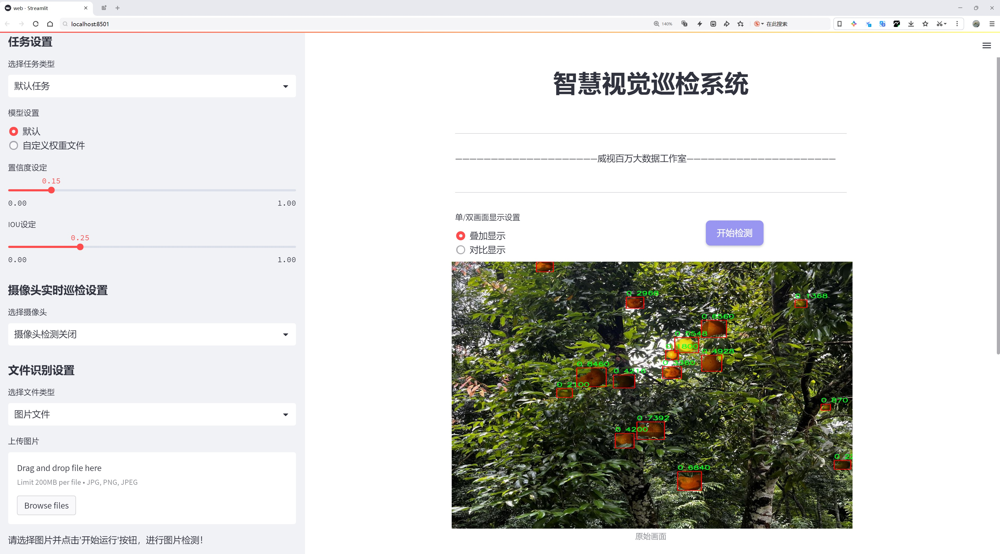
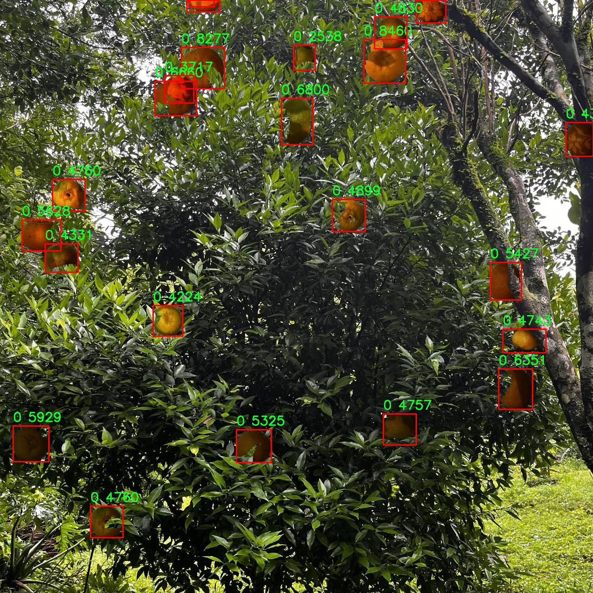

# 柑橘果实检测检测系统源码分享
 # [一条龙教学YOLOV8标注好的数据集一键训练_70+全套改进创新点发刊_Web前端展示]

### 1.研究背景与意义

项目参考[AAAI Association for the Advancement of Artificial Intelligence](https://gitee.com/qunmasj/projects)

项目来源[AACV Association for the Advancement of Computer Vision](https://kdocs.cn/l/cszuIiCKVNis)

研究背景与意义

随着全球人口的不断增长和生活水平的提高，水果的消费需求日益增加，尤其是柑橘类水果因其丰富的营养价值和良好的口感而受到广泛欢迎。柑橘果实的高产量和优质化是现代农业的重要目标之一，而实现这一目标的关键在于高效的果实检测与采摘技术。传统的人工检测方法不仅耗时耗力，而且容易受到人为因素的影响，导致检测结果的不准确性。因此，基于计算机视觉和深度学习技术的自动化果实检测系统应运而生，成为提升柑橘果实生产效率的重要手段。

YOLO（You Only Look Once）系列算法作为一种先进的目标检测技术，以其高效性和实时性在众多应用场景中得到了广泛应用。YOLOv8作为该系列的最新版本，结合了更为精细的特征提取和更强的检测能力，能够在复杂的环境中快速、准确地识别目标。为了提高YOLOv8在柑橘果实检测中的表现，本文提出了一种改进的YOLOv8模型，旨在优化其在特定果实检测任务中的性能。

在本研究中，我们使用了名为“ponkan-sythetic-v2-24042024”的数据集，该数据集包含1900张图像，专注于柑橘类果实的检测。尽管该数据集的类别数量仅为1，但其丰富的图像样本为模型的训练和验证提供了良好的基础。通过对该数据集的深入分析，我们可以提取出柑橘果实在不同光照、角度和背景下的特征信息，从而为改进YOLOv8模型提供必要的数据支持。

本研究的意义在于，通过改进YOLOv8模型，提升柑橘果实的检测精度和速度，从而为农业生产提供智能化的解决方案。具体而言，改进后的检测系统可以实现对柑橘果实的实时监测，帮助农民及时掌握果实的生长状况，合理安排采摘时间，提高果实的采摘效率和质量。此外，该系统还可以为果实的后续处理和物流运输提供数据支持，降低损耗，提高经济效益。

在更广泛的层面上，本研究不仅有助于推动柑橘产业的智能化发展，还为其他农作物的自动化检测提供了借鉴。随着深度学习技术的不断进步，基于改进YOLOv8的果实检测系统将为农业生产带来更多的创新机会，助力实现可持续发展的目标。通过将先进的计算机视觉技术与传统农业相结合，我们期望能够推动农业现代化进程，提高全球食品安全水平，最终实现人与自然的和谐共生。

### 2.图片演示




##### 注意：由于此博客编辑较早，上面“2.图片演示”和“3.视频演示”展示的系统图片或者视频可能为老版本，新版本在老版本的基础上升级如下：（实际效果以升级的新版本为准）

  （1）适配了YOLOV8的“目标检测”模型和“实例分割”模型，通过加载相应的权重（.pt）文件即可自适应加载模型。

  （2）支持“图片识别”、“视频识别”、“摄像头实时识别”三种识别模式。

  （3）支持“图片识别”、“视频识别”、“摄像头实时识别”三种识别结果保存导出，解决手动导出（容易卡顿出现爆内存）存在的问题，识别完自动保存结果并导出到tempDir中。

  （4）支持Web前端系统中的标题、背景图等自定义修改，后面提供修改教程。

  另外本项目提供训练的数据集和训练教程,暂不提供权重文件（best.pt）,需要您按照教程进行训练后实现图片演示和Web前端界面演示的效果。

### 3.视频演示

[3.1 视频演示](https://www.bilibili.com/video/BV1VgsQesEoJ/)

### 4.数据集信息展示

##### 4.1 本项目数据集详细数据（类别数＆类别名）

nc: 1
names: ['0']


##### 4.2 本项目数据集信息介绍

数据集信息展示

在本研究中，我们使用了名为“ponkan-sythetic-v2-24042024”的数据集，以改进YOLOv8的柑橘果实检测系统。该数据集专门为柑橘类水果的检测任务而设计，旨在提高检测精度和效率，尤其是在复杂的环境中。数据集的独特之处在于其合成数据的特性，这使得我们能够在不同的光照、背景和果实状态下进行训练，从而增强模型的泛化能力。

“ponkan-sythetic-v2-24042024”数据集包含了丰富的图像样本，所有样本均为合成生成，确保了数据的多样性和复杂性。尽管该数据集的类别数量为1，具体类别列表中仅包含一个标签“0”，但这一标签代表了柑橘类水果的检测目标。通过这种简化的类别设置，我们能够专注于优化模型在特定目标上的检测能力，而不必分散注意力于多类别的复杂性。

数据集中的图像经过精心设计，涵盖了不同的柑橘果实特征，包括果实的大小、颜色、形状以及表面纹理等。这些特征的多样性为YOLOv8模型提供了充足的训练样本，使其能够在实际应用中有效识别和定位柑橘果实。此外，数据集中还包含了不同的背景和环境条件，如自然光照、阴影、以及各种植物和地面纹理，这些因素都可能影响果实的可见性和检测效果。因此，模型在训练过程中能够学习到如何在不同的视觉条件下保持高效的检测性能。

在数据集的构建过程中，采用了先进的合成技术，以确保生成的图像不仅真实且具有挑战性。这种合成数据的使用不仅降低了数据收集的成本和时间，还避免了传统数据集中可能存在的标注错误和数据偏差问题。通过这种方式，我们能够获得高质量的训练数据，从而为YOLOv8模型的改进奠定坚实的基础。

在训练过程中，我们将使用该数据集进行多轮迭代，以不断优化模型的参数和结构。通过调整学习率、批量大小等超参数，我们希望能够找到最佳的训练配置，以实现更高的检测精度和更快的推理速度。最终，我们的目标是使改进后的YOLOv8模型能够在实际应用中，如农业生产和果园管理中，快速而准确地检测柑橘果实，从而提高生产效率和果实采摘的准确性。

总之，“ponkan-sythetic-v2-24042024”数据集为本研究提供了一个坚实的基础，凭借其丰富的合成图像和单一的检测目标，我们能够专注于提升YOLOv8模型在柑橘果实检测方面的性能。这一数据集的成功应用将为未来的农业智能化发展提供重要的技术支持和实践依据。




### 5.全套项目环境部署视频教程（零基础手把手教学）

[5.1 环境部署教程链接（零基础手把手教学）](https://www.ixigua.com/7404473917358506534?logTag=c807d0cbc21c0ef59de5)


[5.2 安装Python虚拟环境创建和依赖库安装视频教程链接（零基础手把手教学）](https://www.ixigua.com/7404474678003106304?logTag=1f1041108cd1f708b01a)

### 6.手把手YOLOV8训练视频教程（零基础小白有手就能学会）

[6.1 手把手YOLOV8训练视频教程（零基础小白有手就能学会）](https://www.ixigua.com/7404477157818401292?logTag=d31a2dfd1983c9668658)

### 7.70+种全套YOLOV8创新点代码加载调参视频教程（一键加载写好的改进模型的配置文件）

[7.1 70+种全套YOLOV8创新点代码加载调参视频教程（一键加载写好的改进模型的配置文件）](https://www.ixigua.com/7404478314661806627?logTag=29066f8288e3f4eea3a4)

### 8.70+种全套YOLOV8创新点原理讲解（非科班也可以轻松写刊发刊，V10版本正在科研待更新）

由于篇幅限制，每个创新点的具体原理讲解就不一一展开，具体见下列网址中的创新点对应子项目的技术原理博客网址【Blog】：


[8.1 70+种全套YOLOV8创新点原理讲解链接](https://gitee.com/qunmasj/good)

### 9.系统功能展示（检测对象为举例，实际内容以本项目数据集为准）

图9.1.系统支持检测结果表格显示

  图9.2.系统支持置信度和IOU阈值手动调节

  图9.3.系统支持自定义加载权重文件best.pt(需要你通过步骤5中训练获得)

  图9.4.系统支持摄像头实时识别

  图9.5.系统支持图片识别

  图9.6.系统支持视频识别

  图9.7.系统支持识别结果文件自动保存

  图9.8.系统支持Excel导出检测结果数据


### 10.原始YOLOV8算法原理

原始YOLOv8算法原理

YOLOv8算法是由Ultralytics公司于2023年推出的最新一代目标检测算法，标志着YOLO系列在深度学习领域的又一次重要进步。作为一种一阶段目标检测算法，YOLOv8通过将目标检测任务转化为回归问题，利用单一神经网络模型同时预测目标的位置和类别，从而实现了高效的目标检测。与前几代YOLO算法相比，YOLOv8在训练时间、检测精度和模型轻量化方面都有显著提升，能够满足实时检测的需求，并且可以轻松部署到各种嵌入式设备上。

YOLOv8的网络结构主要由三个部分组成：Backbone（主干网络）、Neck（特征增强网络）和Head（检测头）。在Backbone部分，YOLOv8采用了一系列卷积和反卷积层，以提取输入图像的特征。该部分的设计灵感来源于CSPNet（Cross Stage Partial Network），通过将特征提取过程分为两部分进行卷积和连接，减少了计算量并提高了特征提取的效率。YOLOv8的Backbone包含了5个CBS模块、4个C2f模块和1个快速空间金字塔池化（SPPF）模块，后者的引入进一步提升了模型的计算速度和特征表达能力。残差连接和瓶颈结构的使用，使得网络在保持较小规模的同时，能够有效地捕捉复杂的特征信息。

在Neck部分，YOLOv8采用了PAN-FPN（Path Aggregation Network - Feature Pyramid Network）结构，旨在实现多尺度特征的融合。通过将来自Backbone不同阶段的特征图进行有效的融合，YOLOv8能够更好地捕捉不同尺度目标的信息，从而提高目标检测的性能和鲁棒性。这种多尺度特征融合技术，使得YOLOv8在处理不同大小的目标时，能够展现出更强的适应性和准确性。

Head部分是YOLOv8的核心，负责最终的目标检测和分类任务。与以往的YOLO版本不同，YOLOv8在检测头中采用了解耦头结构，将分类和回归任务分为两个独立的分支。这样的设计使得每个任务可以更加专注于自身的目标，从而有效解决复杂场景下可能出现的定位不准和分类错误的问题。此外，YOLOv8引入了Anchor-Free目标检测方法，避免了传统方法中预先定义锚点框的繁琐过程。通过直接预测目标的位置和大小，YOLOv8能够更快地聚焦于目标位置的邻近点，使得预测框更接近于实际边界框区域。

YOLOv8算法的五种网络结构（YOLOv8n、YOLOv8s、YOLOv8m、YOLOv8l和YOLOv8x）在Backbone的层数和残差块的数量上有所不同，但基本原理保持一致。这种灵活的设计使得用户可以根据具体应用场景和计算资源的限制，选择合适的网络结构进行目标检测任务。YOLOv8n作为其中最小的版本，采用了C2f模块替换了YOLOv5中的C3模块，进一步提升了模型的计算效率和准确性。

总的来说，YOLOv8在继承YOLO系列的优良传统的基础上，通过引入新的网络结构和优化策略，提升了目标检测的速度和精度。其轻量化的模型设计，使得YOLOv8能够在多种硬件平台上高效运行，广泛适用于实时目标检测的应用场景。无论是在自动驾驶、安防监控，还是在工业检测等领域，YOLOv8都展现出了其强大的性能和广泛的适用性，成为目标检测领域的重要工具。


### 11.项目核心源码讲解（再也不用担心看不懂代码逻辑）

#### 11.1 ui.py

以下是代码的核心部分，并附上详细的中文注释：

```python
import sys
import subprocess

def run_script(script_path):
    """
    使用当前 Python 环境运行指定的脚本。

    Args:
        script_path (str): 要运行的脚本路径

    Returns:
        None
    """
    # 获取当前 Python 解释器的路径
    python_path = sys.executable

    # 构建运行命令，使用 streamlit 运行指定的脚本
    command = f'"{python_path}" -m streamlit run "{script_path}"'

    # 执行命令，并等待其完成
    result = subprocess.run(command, shell=True)
    
    # 检查命令执行的返回码，非零表示出错
    if result.returncode != 0:
        print("脚本运行出错。")

# 实例化并运行应用
if __name__ == "__main__":
    # 指定要运行的脚本路径
    script_path = "web.py"  # 这里可以直接指定脚本名，假设在当前目录下

    # 调用函数运行脚本
    run_script(script_path)
```

### 代码分析：
1. **导入模块**：
   - `sys`：用于获取当前 Python 解释器的路径。
   - `subprocess`：用于执行外部命令。

2. **`run_script` 函数**：
   - 接受一个参数 `script_path`，表示要运行的 Python 脚本的路径。
   - 使用 `sys.executable` 获取当前 Python 解释器的路径。
   - 构建一个命令字符串，用于通过 `streamlit` 运行指定的脚本。
   - 使用 `subprocess.run` 执行命令，并等待命令完成。
   - 检查命令的返回码，如果不为零，则输出错误信息。

3. **主程序块**：
   - 在 `__main__` 中指定要运行的脚本路径。
   - 调用 `run_script` 函数来执行指定的脚本。

### 注意事项：
- `abs_path` 函数在这里被省略，假设脚本路径是相对路径，且脚本 `web.py` 与当前执行文件在同一目录下。
- `subprocess.run` 的 `shell=True` 参数使得命令在 shell 中执行，这在某些情况下可能会引发安全问题，需谨慎使用。

这个程序文件 `ui.py` 的主要功能是运行一个指定的 Python 脚本，具体来说是通过 Streamlit 框架来启动一个 Web 应用。代码中首先导入了必要的模块，包括 `sys`、`os` 和 `subprocess`，这些模块分别用于获取系统信息、处理文件路径和执行外部命令。

在 `run_script` 函数中，首先获取当前 Python 解释器的路径，这样可以确保在正确的环境中运行脚本。接着，构建一个命令字符串，该命令使用 Streamlit 来运行指定的脚本。命令的格式是 `python -m streamlit run "script_path"`，其中 `script_path` 是要运行的脚本的路径。

随后，使用 `subprocess.run` 方法执行这个命令。这个方法会在一个新的进程中运行命令，并等待其完成。执行后，如果返回的状态码不为零，表示脚本运行出错，此时会打印出错误信息。

在文件的最后部分，使用 `if __name__ == "__main__":` 语句来确保只有在直接运行该脚本时才会执行后面的代码。这里指定了要运行的脚本路径为 `web.py`，并调用 `run_script` 函数来启动这个脚本。

总的来说，这个文件的作用是提供一个简单的接口来运行一个 Streamlit 应用，确保在正确的 Python 环境中执行，并处理可能出现的错误。

#### 11.2 code\ultralytics\nn\modules\conv.py

以下是代码中最核心的部分，并附上详细的中文注释：

```python
import math
import torch
import torch.nn as nn

def autopad(k, p=None, d=1):  # kernel, padding, dilation
    """自动填充以确保输出形状与输入形状相同。"""
    if d > 1:
        # 计算实际的卷积核大小
        k = d * (k - 1) + 1 if isinstance(k, int) else [d * (x - 1) + 1 for x in k]
    if p is None:
        # 默认填充为卷积核大小的一半
        p = k // 2 if isinstance(k, int) else [x // 2 for x in k]
    return p

class Conv(nn.Module):
    """标准卷积层，包含输入通道、输出通道、卷积核大小、步幅、填充、分组、扩张和激活函数等参数。"""

    default_act = nn.SiLU()  # 默认激活函数

    def __init__(self, c1, c2, k=1, s=1, p=None, g=1, d=1, act=True):
        """初始化卷积层，设置卷积、批归一化和激活函数。"""
        super().__init__()
        self.conv = nn.Conv2d(c1, c2, k, s, autopad(k, p, d), groups=g, dilation=d, bias=False)
        self.bn = nn.BatchNorm2d(c2)  # 批归一化
        self.act = self.default_act if act is True else act if isinstance(act, nn.Module) else nn.Identity()

    def forward(self, x):
        """前向传播：应用卷积、批归一化和激活函数。"""
        return self.act(self.bn(self.conv(x)))

class DWConv(Conv):
    """深度卷积层，适用于每个输入通道独立进行卷积。"""

    def __init__(self, c1, c2, k=1, s=1, d=1, act=True):
        """初始化深度卷积层，设置参数。"""
        super().__init__(c1, c2, k, s, g=math.gcd(c1, c2), d=d, act=act)

class ConvTranspose(nn.Module):
    """转置卷积层，用于上采样。"""

    default_act = nn.SiLU()  # 默认激活函数

    def __init__(self, c1, c2, k=2, s=2, p=0, bn=True, act=True):
        """初始化转置卷积层，设置批归一化和激活函数。"""
        super().__init__()
        self.conv_transpose = nn.ConvTranspose2d(c1, c2, k, s, p, bias=not bn)
        self.bn = nn.BatchNorm2d(c2) if bn else nn.Identity()
        self.act = self.default_act if act is True else act if isinstance(act, nn.Module) else nn.Identity()

    def forward(self, x):
        """前向传播：应用转置卷积、批归一化和激活函数。"""
        return self.act(self.bn(self.conv_transpose(x)))

class ChannelAttention(nn.Module):
    """通道注意力模块，用于增强特征通道的重要性。"""

    def __init__(self, channels: int) -> None:
        """初始化通道注意力模块，设置基本配置。"""
        super().__init__()
        self.pool = nn.AdaptiveAvgPool2d(1)  # 自适应平均池化
        self.fc = nn.Conv2d(channels, channels, 1, 1, 0, bias=True)  # 1x1卷积
        self.act = nn.Sigmoid()  # Sigmoid激活函数

    def forward(self, x: torch.Tensor) -> torch.Tensor:
        """前向传播：计算通道注意力并调整输入特征。"""
        return x * self.act(self.fc(self.pool(x)))

class SpatialAttention(nn.Module):
    """空间注意力模块，用于增强特征图的空间信息。"""

    def __init__(self, kernel_size=7):
        """初始化空间注意力模块，设置卷积核大小。"""
        super().__init__()
        assert kernel_size in (3, 7), "卷积核大小必须为3或7"
        padding = 3 if kernel_size == 7 else 1
        self.cv1 = nn.Conv2d(2, 1, kernel_size, padding=padding, bias=False)  # 卷积层
        self.act = nn.Sigmoid()  # Sigmoid激活函数

    def forward(self, x):
        """前向传播：计算空间注意力并调整输入特征。"""
        return x * self.act(self.cv1(torch.cat([torch.mean(x, 1, keepdim=True), torch.max(x, 1, keepdim=True)[0]], 1)))

class CBAM(nn.Module):
    """卷积块注意力模块，结合通道和空间注意力。"""

    def __init__(self, c1, kernel_size=7):
        """初始化CBAM模块，设置输入通道和卷积核大小。"""
        super().__init__()
        self.channel_attention = ChannelAttention(c1)  # 通道注意力
        self.spatial_attention = SpatialAttention(kernel_size)  # 空间注意力

    def forward(self, x):
        """前向传播：依次应用通道和空间注意力。"""
        return self.spatial_attention(self.channel_attention(x))
```

### 代码核心部分说明：
1. **自动填充函数 (`autopad`)**：用于计算卷积操作时的填充量，以确保输出形状与输入形状相同。
2. **卷积层 (`Conv`)**：实现了标准的卷积操作，包含卷积、批归一化和激活函数的组合。
3. **深度卷积层 (`DWConv`)**：对每个输入通道独立进行卷积的层，适用于深度可分离卷积。
4. **转置卷积层 (`ConvTranspose`)**：用于上采样的转置卷积层，结合了批归一化和激活函数。
5. **通道注意力模块 (`ChannelAttention`)**：通过自适应平均池化和1x1卷积计算通道注意力。
6. **空间注意力模块 (`SpatialAttention`)**：通过卷积计算空间注意力，增强特征图的空间信息。
7. **CBAM模块 (`CBAM`)**：结合通道和空间注意力的模块，增强特征表示能力。

这些模块是构建深度学习模型，尤其是计算机视觉任务中常用的基础组件。

这个程序文件定义了一系列卷积模块，主要用于深度学习中的图像处理，特别是在YOLO（You Only Look Once）模型中。文件中包含了多个类和函数，主要实现了不同类型的卷积操作以及一些注意力机制。

首先，文件引入了必要的库，包括`torch`和`torch.nn`，这些是PyTorch框架的核心组件。接着，定义了一个`autopad`函数，用于根据卷积核的大小、填充和扩张因子自动计算填充量，以确保输出的形状与输入相同。

接下来，定义了多个卷积类：

1. **Conv**：标准卷积层，包含卷积操作、批归一化和激活函数。它的构造函数允许用户自定义输入通道数、输出通道数、卷积核大小、步幅、填充、分组数、扩张因子和激活函数。

2. **Conv2**：简化的卷积模块，结合了两个卷积操作。它在标准卷积的基础上增加了一个1x1的卷积，用于提升特征提取能力。

3. **LightConv**：轻量级卷积模块，使用了深度卷积（Depth-wise Convolution）和标准卷积的组合，旨在减少计算量。

4. **DWConv**：深度卷积，专注于每个输入通道独立进行卷积操作，减少参数量和计算量。

5. **DWConvTranspose2d**：深度转置卷积，类似于标准转置卷积，但使用深度卷积的方式。

6. **ConvTranspose**：转置卷积层，通常用于上采样操作，支持批归一化和激活函数。

7. **Focus**：将输入的空间信息聚焦到通道上，通过对输入进行分块并拼接，增强特征表达。

8. **GhostConv**：一种特殊的卷积，使用了GhostNet的思想，通过生成更多的特征图来提高模型的表现。

9. **RepConv**：重复卷积模块，结合了多个卷积层的输出，支持训练和推理阶段的不同操作。

接下来，文件中还定义了几个注意力机制模块：

1. **ChannelAttention**：通道注意力模块，通过自适应平均池化和全连接层来调整通道的权重。

2. **SpatialAttention**：空间注意力模块，通过对输入特征图进行平均和最大池化，生成空间权重。

3. **CBAM**：卷积块注意力模块，结合了通道注意力和空间注意力，增强特征图的表达能力。

最后，定义了一个`Concat`类，用于在指定维度上拼接多个张量，常用于特征融合。

整体来看，这个文件实现了多种卷积和注意力机制的组合，旨在提高深度学习模型在图像处理任务中的性能和效率。每个模块都具有灵活的参数设置，便于在不同的网络架构中使用。

#### 11.3 70+种YOLOv8算法改进源码大全和调试加载训练教程（非必要）\ultralytics\models\rtdetr\model.py

```python
# Ultralytics YOLO 🚀, AGPL-3.0 license
"""
RT-DETR模型接口，基于视觉变换器的实时目标检测器。RT-DETR提供实时性能和高准确性，
在CUDA和TensorRT等加速后端中表现出色。它具有高效的混合编码器和IoU感知查询选择，
以提高检测准确性。

有关RT-DETR的更多信息，请访问：https://arxiv.org/pdf/2304.08069.pdf
"""

from ultralytics.engine.model import Model  # 导入基础模型类
from ultralytics.nn.tasks import RTDETRDetectionModel  # 导入RT-DETR检测模型类

from .predict import RTDETRPredictor  # 导入预测器
from .train import RTDETRTrainer  # 导入训练器
from .val import RTDETRValidator  # 导入验证器


class RTDETR(Model):
    """
    RT-DETR模型接口。该基于视觉变换器的目标检测器提供实时性能和高准确性。
    支持高效的混合编码、IoU感知查询选择和可调的推理速度。

    属性:
        model (str): 预训练模型的路径。默认为'rtdetr-l.pt'。
    """

    def __init__(self, model='rtdetr-l.pt') -> None:
        """
        使用给定的预训练模型文件初始化RT-DETR模型。支持.pt和.yaml格式。

        参数:
            model (str): 预训练模型的路径。默认为'rtdetr-l.pt'。

        异常:
            NotImplementedError: 如果模型文件扩展名不是'pt'、'yaml'或'yml'。
        """
        # 检查模型文件的扩展名是否有效
        if model and model.split('.')[-1] not in ('pt', 'yaml', 'yml'):
            raise NotImplementedError('RT-DETR仅支持从*.pt、*.yaml或*.yml文件创建。')
        # 调用父类的初始化方法
        super().__init__(model=model, task='detect')

    @property
    def task_map(self) -> dict:
        """
        返回RT-DETR的任务映射，将任务与相应的Ultralytics类关联。

        返回:
            dict: 一个字典，将任务名称映射到RT-DETR模型的Ultralytics任务类。
        """
        return {
            'detect': {
                'predictor': RTDETRPredictor,  # 预测器类
                'validator': RTDETRValidator,  # 验证器类
                'trainer': RTDETRTrainer,  # 训练器类
                'model': RTDETRDetectionModel  # RT-DETR检测模型类
            }
        }
```

### 代码核心部分及注释说明：

1. **导入必要的模块**：
   - 导入了基础模型类和RT-DETR相关的预测、训练和验证模块。

2. **RTDETR类定义**：
   - 该类继承自`Model`，用于实现RT-DETR模型的接口。

3. **初始化方法**：
   - `__init__`方法用于初始化RT-DETR模型，接受一个模型路径参数，默认值为'rtdetr-l.pt'。
   - 在初始化时检查模型文件的扩展名，确保其为支持的格式（.pt, .yaml, .yml），否则抛出`NotImplementedError`。

4. **任务映射属性**：
   - `task_map`属性返回一个字典，映射了检测任务到相应的Ultralytics类，包括预测器、验证器、训练器和检测模型类。这使得不同的任务可以通过相应的类进行处理。

该程序文件是Ultralytics YOLO系列中的一个模块，专门用于实现百度的RT-DETR模型。RT-DETR是一种基于视觉变换器（Vision Transformer）的实时目标检测器，具有高效的实时性能和高准确度，特别是在使用CUDA和TensorRT等加速后端时表现优异。该模型采用了高效的混合编码器和IoU（Intersection over Union）感知查询选择，以提高检测的准确性。

在文件中，首先导入了必要的模块，包括Ultralytics引擎中的Model类和RTDETRDetectionModel类，以及用于预测、训练和验证的相关模块。接着定义了RTDETR类，该类继承自Model类，提供了RT-DETR模型的接口。

RTDETR类的构造函数接受一个参数model，表示预训练模型的路径，默认值为'rtdetr-l.pt'。在初始化过程中，程序会检查提供的模型文件扩展名是否为支持的格式（.pt、.yaml或.yml），如果不符合，则抛出NotImplementedError异常，提示用户仅支持这几种格式。

此外，RTDETR类还定义了一个属性task_map，该属性返回一个字典，映射与RT-DETR模型相关的任务及其对应的Ultralytics类。这些任务包括预测（predictor）、验证（validator）和训练（trainer），以及使用的模型类（model）。这个映射关系使得在使用RT-DETR进行目标检测时，可以方便地调用相应的功能模块。

总体来说，该文件提供了RT-DETR模型的基本结构和接口，便于用户进行目标检测任务的实现和扩展。

#### 11.4 train.py

以下是代码中最核心的部分，并附上详细的中文注释：

```python
class DetectionTrainer(BaseTrainer):
    """
    扩展自 BaseTrainer 类的检测模型训练类。
    """

    def build_dataset(self, img_path, mode="train", batch=None):
        """
        构建 YOLO 数据集。

        参数:
            img_path (str): 包含图像的文件夹路径。
            mode (str): 模式，可以是 'train' 或 'val'，用户可以为每种模式自定义不同的数据增强。
            batch (int, optional): 批次大小，仅用于 'rect' 模式。默认为 None。
        """
        gs = max(int(de_parallel(self.model).stride.max() if self.model else 0), 32)
        return build_yolo_dataset(self.args, img_path, batch, self.data, mode=mode, rect=mode == "val", stride=gs)

    def get_dataloader(self, dataset_path, batch_size=16, rank=0, mode="train"):
        """构造并返回数据加载器。"""
        assert mode in ["train", "val"]  # 确保模式有效
        with torch_distributed_zero_first(rank):  # 在分布式训练中，仅初始化数据集一次
            dataset = self.build_dataset(dataset_path, mode, batch_size)
        shuffle = mode == "train"  # 训练模式下打乱数据
        if getattr(dataset, "rect", False) and shuffle:
            LOGGER.warning("WARNING ⚠️ 'rect=True' 与 DataLoader 的 shuffle 不兼容，设置 shuffle=False")
            shuffle = False
        workers = self.args.workers if mode == "train" else self.args.workers * 2  # 根据模式设置工作线程数
        return build_dataloader(dataset, batch_size, workers, shuffle, rank)  # 返回数据加载器

    def preprocess_batch(self, batch):
        """对一批图像进行预处理，包括缩放和转换为浮点数。"""
        batch["img"] = batch["img"].to(self.device, non_blocking=True).float() / 255  # 将图像转移到设备并归一化
        if self.args.multi_scale:  # 如果启用多尺度训练
            imgs = batch["img"]
            sz = (
                random.randrange(self.args.imgsz * 0.5, self.args.imgsz * 1.5 + self.stride)
                // self.stride
                * self.stride
            )  # 随机选择新的尺寸
            sf = sz / max(imgs.shape[2:])  # 计算缩放因子
            if sf != 1:
                ns = [
                    math.ceil(x * sf / self.stride) * self.stride for x in imgs.shape[2:]
                ]  # 计算新的形状
                imgs = nn.functional.interpolate(imgs, size=ns, mode="bilinear", align_corners=False)  # 进行插值缩放
            batch["img"] = imgs  # 更新批次中的图像
        return batch

    def set_model_attributes(self):
        """设置模型的属性，包括类别数量和名称。"""
        self.model.nc = self.data["nc"]  # 将类别数量附加到模型
        self.model.names = self.data["names"]  # 将类别名称附加到模型
        self.model.args = self.args  # 将超参数附加到模型

    def get_model(self, cfg=None, weights=None, verbose=True):
        """返回 YOLO 检测模型。"""
        model = DetectionModel(cfg, nc=self.data["nc"], verbose=verbose and RANK == -1)  # 创建检测模型
        if weights:
            model.load(weights)  # 加载权重
        return model

    def get_validator(self):
        """返回用于 YOLO 模型验证的 DetectionValidator。"""
        self.loss_names = "box_loss", "cls_loss", "dfl_loss"  # 定义损失名称
        return yolo.detect.DetectionValidator(
            self.test_loader, save_dir=self.save_dir, args=copy(self.args), _callbacks=self.callbacks
        )

    def label_loss_items(self, loss_items=None, prefix="train"):
        """
        返回带标签的训练损失项字典。

        对于分类不需要，但对于分割和检测是必要的。
        """
        keys = [f"{prefix}/{x}" for x in self.loss_names]  # 创建损失项的键
        if loss_items is not None:
            loss_items = [round(float(x), 5) for x in loss_items]  # 将张量转换为保留5位小数的浮点数
            return dict(zip(keys, loss_items))  # 返回损失项字典
        else:
            return keys

    def plot_training_samples(self, batch, ni):
        """绘制带有注释的训练样本。"""
        plot_images(
            images=batch["img"],
            batch_idx=batch["batch_idx"],
            cls=batch["cls"].squeeze(-1),
            bboxes=batch["bboxes"],
            paths=batch["im_file"],
            fname=self.save_dir / f"train_batch{ni}.jpg",
            on_plot=self.on_plot,
        )

    def plot_metrics(self):
        """从 CSV 文件中绘制指标。"""
        plot_results(file=self.csv, on_plot=self.on_plot)  # 保存结果图像

    def plot_training_labels(self):
        """创建 YOLO 模型的标记训练图。"""
        boxes = np.concatenate([lb["bboxes"] for lb in self.train_loader.dataset.labels], 0)  # 合并所有边界框
        cls = np.concatenate([lb["cls"] for lb in self.train_loader.dataset.labels], 0)  # 合并所有类别
        plot_labels(boxes, cls.squeeze(), names=self.data["names"], save_dir=self.save_dir, on_plot=self.on_plot)  # 绘制标签
```

### 代码核心部分说明：
1. **DetectionTrainer 类**：这是一个用于训练 YOLO 检测模型的类，继承自 BaseTrainer。
2. **build_dataset 方法**：构建数据集，处理图像路径和模式（训练或验证）。
3. **get_dataloader 方法**：创建数据加载器，支持分布式训练。
4. **preprocess_batch 方法**：对图像批次进行预处理，包括归一化和多尺度调整。
5. **set_model_attributes 方法**：设置模型的类别数量和名称。
6. **get_model 方法**：返回一个 YOLO 检测模型实例，并可选择加载预训练权重。
7. **get_validator 方法**：返回用于模型验证的验证器。
8. **label_loss_items 方法**：返回带有标签的损失项字典。
9. **plot_training_samples 方法**：绘制训练样本及其注释。
10. **plot_metrics 方法**：绘制训练过程中的指标。
11. **plot_training_labels 方法**：绘制带标签的训练数据。

这个程序文件 `train.py` 是一个用于训练 YOLO（You Only Look Once）目标检测模型的脚本，继承自 `BaseTrainer` 类。它主要负责构建数据集、加载数据、预处理图像、设置模型属性、获取模型、验证模型、记录损失、显示训练进度、绘制训练样本和指标等功能。

首先，`DetectionTrainer` 类定义了用于训练的基本结构。它包含多个方法，每个方法负责特定的功能。例如，`build_dataset` 方法用于构建 YOLO 数据集，接收图像路径、模式（训练或验证）和批次大小作为参数。该方法会根据模型的步幅计算出合适的步幅值，并调用 `build_yolo_dataset` 函数来生成数据集。

`get_dataloader` 方法则用于构建数据加载器，确保在分布式训练时只初始化一次数据集。它会根据模式选择是否打乱数据，并根据训练或验证的不同设置工作线程数。

在数据预处理方面，`preprocess_batch` 方法会将图像批次缩放并转换为浮点数格式，确保输入模型的数据符合要求。如果启用了多尺度训练，它还会随机选择图像大小并调整图像的尺寸。

`set_model_attributes` 方法用于设置模型的属性，包括类别数量和类别名称，以便模型能够正确识别和分类目标。

`get_model` 方法用于返回一个 YOLO 检测模型，并在提供权重时加载这些权重。`get_validator` 方法则返回一个用于验证模型的 `DetectionValidator` 实例，记录损失名称以便后续分析。

`label_loss_items` 方法用于返回带有标签的训练损失字典，适用于分割和检测任务。`progress_string` 方法返回一个格式化的字符串，显示训练进度，包括当前的轮次、GPU 内存使用情况、损失值、实例数量和图像大小。

在训练过程中，`plot_training_samples` 方法会绘制训练样本及其标注，便于可视化训练效果。最后，`plot_metrics` 和 `plot_training_labels` 方法用于绘制训练过程中的指标和标签，以便于分析模型的性能。

整体来看，这个脚本提供了一个完整的框架，用于训练 YOLO 模型，支持多种功能以提高训练效率和效果。

#### 11.5 70+种YOLOv8算法改进源码大全和调试加载训练教程（非必要）\ultralytics\utils\callbacks\__init__.py

以下是经过简化和详细注释的核心代码部分：

```python
# 导入必要的函数和模块
from .base import add_integration_callbacks, default_callbacks, get_default_callbacks

# 定义模块的公开接口，指定可以被外部访问的名称
__all__ = 'add_integration_callbacks', 'default_callbacks', 'get_default_callbacks'
```

### 代码注释说明：

1. **导入模块**：
   - `from .base import add_integration_callbacks, default_callbacks, get_default_callbacks`：从当前包的 `base` 模块中导入三个函数：`add_integration_callbacks`、`default_callbacks` 和 `get_default_callbacks`。这些函数可能用于处理回调函数的集成和默认设置。

2. **定义公开接口**：
   - `__all__ = 'add_integration_callbacks', 'default_callbacks', 'get_default_callbacks'`：通过定义 `__all__`，指定了当前模块中哪些名称是可以被外部导入的。这意味着当使用 `from module import *` 时，只会导入这些指定的名称。这有助于控制模块的公共 API，避免不必要的名称冲突和隐藏内部实现细节。

这个程序文件是一个Python模块，属于Ultralytics YOLO项目的一部分，主要用于处理回调函数的相关功能。文件开头的注释表明该项目使用的是AGPL-3.0许可证，意味着该代码可以自由使用和修改，但需要遵循相应的开源协议。

在代码中，首先从同一目录下的`base`模块导入了三个函数：`add_integration_callbacks`、`default_callbacks`和`get_default_callbacks`。这些函数可能用于设置和管理与YOLO模型训练和推理过程相关的回调功能。回调函数在机器学习和深度学习中通常用于在特定事件发生时执行特定的操作，比如在每个训练周期结束时保存模型、调整学习率等。

最后，`__all__`变量被定义为一个元组，包含了刚刚导入的三个函数名。这一行的作用是控制模块的公共接口，意味着当使用`from module import *`语句时，只会导入`__all__`中列出的函数。这是一种良好的编程习惯，有助于避免不必要的命名冲突和提高代码的可读性。

总的来说，这个文件的主要功能是提供一些回调函数的导入和管理，便于在YOLO模型的训练和推理过程中进行灵活的操作和扩展。

#### 11.6 70+种YOLOv8算法改进源码大全和调试加载训练教程（非必要）\ultralytics\utils\metrics.py

以下是代码中最核心的部分，并附上详细的中文注释：

```python
import numpy as np
import torch

def box_iou(box1, box2, eps=1e-7):
    """
    计算两个边界框的交并比（IoU）。
    
    Args:
        box1 (torch.Tensor): 形状为 (N, 4) 的张量，表示 N 个边界框。
        box2 (torch.Tensor): 形状为 (M, 4) 的张量，表示 M 个边界框。
        eps (float, optional): 避免除以零的小值，默认为 1e-7。

    Returns:
        (torch.Tensor): 形状为 (N, M) 的张量，包含 box1 和 box2 中每对边界框的 IoU 值。
    """
    # 计算交集区域
    (a1, a2), (b1, b2) = box1.unsqueeze(1).chunk(2, 2), box2.unsqueeze(0).chunk(2, 2)
    inter = (torch.min(a2, b2) - torch.max(a1, b1)).clamp_(0).prod(2)

    # 计算并集区域
    return inter / ((a2 - a1).prod(2) + (b2 - b1).prod(2) - inter + eps)

def bbox_iou(box1, box2, xywh=True, eps=1e-7):
    """
    计算单个边界框与多个边界框之间的交并比（IoU）。
    
    Args:
        box1 (torch.Tensor): 形状为 (1, 4) 的张量，表示单个边界框。
        box2 (torch.Tensor): 形状为 (n, 4) 的张量，表示 n 个边界框。
        xywh (bool, optional): 如果为 True，输入框为 (x, y, w, h) 格式；如果为 False，输入框为 (x1, y1, x2, y2) 格式。默认为 True。
        eps (float, optional): 避免除以零的小值，默认为 1e-7。

    Returns:
        (torch.Tensor): 计算得到的 IoU 值。
    """
    # 获取边界框的坐标
    if xywh:  # 从 (x, y, w, h) 转换为 (x1, y1, x2, y2)
        (x1, y1, w1, h1), (x2, y2, w2, h2) = box1.chunk(4, -1), box2.chunk(4, -1)
        b1_x1, b1_x2, b1_y1, b1_y2 = x1 - w1 / 2, x1 + w1 / 2, y1 - h1 / 2, y1 + h1 / 2
        b2_x1, b2_x2, b2_y1, b2_y2 = x2 - w2 / 2, x2 + w2 / 2, y2 - h2 / 2, y2 + h2 / 2
    else:  # 直接使用 (x1, y1, x2, y2)
        b1_x1, b1_y1, b1_x2, b1_y2 = box1.chunk(4, -1)
        b2_x1, b2_y1, b2_x2, b2_y2 = box2.chunk(4, -1)

    # 计算交集区域
    inter = (b1_x2.minimum(b2_x2) - b1_x1.maximum(b2_x1)).clamp_(0) * \
            (b1_y2.minimum(b2_y2) - b1_y1.maximum(b2_y1)).clamp_(0)

    # 计算并集区域
    union = (b1_x2 - b1_x1).prod() + (b2_x2 - b2_x1).prod() - inter + eps

    # 返回 IoU 值
    return inter / union

def compute_ap(recall, precision):
    """
    计算给定召回率和精确率曲线的平均精度（AP）。
    
    Args:
        recall (list): 召回率曲线。
        precision (list): 精确率曲线。

    Returns:
        (float): 平均精度。
        (np.ndarray): 精确率包络曲线。
        (np.ndarray): 修改后的召回率曲线，添加了开头和结尾的哨兵值。
    """
    # 在开头和结尾添加哨兵值
    mrec = np.concatenate(([0.0], recall, [1.0]))
    mpre = np.concatenate(([1.0], precision, [0.0]))

    # 计算精确率包络
    mpre = np.flip(np.maximum.accumulate(np.flip(mpre)))

    # 计算曲线下面积
    x = np.linspace(0, 1, 101)  # 101 点插值（COCO）
    ap = np.trapz(np.interp(x, mrec, mpre), x)  # 积分

    return ap, mpre, mrec
```

### 代码说明：
1. **box_iou**：计算两个边界框之间的交并比（IoU），用于评估目标检测模型的性能。
2. **bbox_iou**：计算单个边界框与多个边界框之间的 IoU，支持不同的输入格式（xywh 或 xyxy）。
3. **compute_ap**：计算平均精度（AP），用于评估精确率和召回率曲线的性能。

这些函数是目标检测模型评估中最重要的部分，能够帮助我们量化模型的检测效果。

这个程序文件是用于计算和评估YOLOv8模型的各种指标，主要涉及目标检测、分类、分割和姿态估计等任务。文件中包含了多个函数和类，具体功能如下：

首先，文件导入了一些必要的库，包括数学运算、警告处理、路径处理、绘图、NumPy和PyTorch等。接着定义了一些常量和函数，用于计算不同类型的指标。

`bbox_ioa`函数计算两个边界框之间的交集与box2的面积比，支持计算标准的IoU（Intersection over Union）或交集面积与box2面积的比值。`box_iou`函数计算两个集合的边界框之间的IoU，返回一个N×M的张量，表示每对边界框的IoU值。`bbox_iou`函数则计算单个边界框与多个边界框之间的IoU，支持多种IoU计算方式，如GIoU、DIoU、CIoU等。

`get_inner_iou`和`bbox_inner_iou`函数用于计算边界框的内部IoU，`bbox_mpdiou`和`bbox_inner_mpdiou`函数则计算边界框的MPDIoU（Modified Distance IoU），考虑了边界框之间的距离。

`wasserstein_loss`函数实现了Wasserstein损失，用于评估预测边界框与真实边界框之间的差异。`mask_iou`函数计算两个掩膜之间的IoU，`kpt_iou`函数计算关键点相似性（OKS），用于评估关键点检测的准确性。

`smooth_BCE`函数计算平滑的二元交叉熵目标，用于处理标签平滑。`ConfusionMatrix`类用于计算和更新混淆矩阵，支持分类和检测任务，提供了处理预测结果、绘制混淆矩阵等功能。

接下来，`Metric`类用于计算YOLOv8模型的评估指标，包括精度、召回率、平均精度（AP）等，提供了多种方法来获取这些指标的值。`DetMetrics`类则专注于目标检测的指标计算，支持处理预测结果并更新相应的指标。

`SegmentMetrics`和`PoseMetrics`类分别用于计算分割和姿态估计的指标，支持处理掩膜和关键点的预测结果。`ClassifyMetrics`类用于计算分类任务的指标，包括top-1和top-5准确率。

整体而言，这个文件提供了YOLOv8模型评估所需的多种指标计算方法和工具，适用于目标检测、分类、分割和姿态估计等任务的性能评估。通过这些函数和类，用户可以方便地计算模型的各种性能指标，并进行可视化展示。

### 12.系统整体结构（节选）

### 整体功能和构架概括

该项目是一个基于YOLO（You Only Look Once）模型的目标检测框架，包含多个模块和工具，旨在提供高效的目标检测、分类、分割和姿态估计功能。整体架构由多个文件组成，每个文件负责特定的功能，如模型定义、训练过程、回调管理、指标计算和数据处理等。通过这些模块，用户可以方便地进行模型训练、评估和推理，支持多种扩展和改进。

### 文件功能整理表

| 文件路径                                                                                               | 功能描述                                                         |
|--------------------------------------------------------------------------------------------------------|------------------------------------------------------------------|
| `D:\tools\20240809\code\ui.py`                                                                        | 启动Streamlit Web应用，提供用户界面以运行YOLO模型。             |
| `D:\tools\20240809\code\ultralytics\nn\modules\conv.py`                                              | 定义多种卷积模块和注意力机制，用于深度学习模型的特征提取。     |
| `D:\tools\20240809\code\70+种YOLOv8算法改进源码大全和调试加载训练教程（非必要）\ultralytics\models\rtdetr\model.py` | 实现RT-DETR模型的结构和接口，支持目标检测任务。                 |
| `D:\tools\20240809\code\train.py`                                                                     | 提供YOLO模型的训练框架，处理数据集、模型属性设置和训练过程。   |
| `D:\tools\20240809\code\70+种YOLOv8算法改进源码大全和调试加载训练教程（非必要）\ultralytics\utils\callbacks\__init__.py` | 管理回调函数，支持训练和推理过程中的灵活操作。                  |
| `D:\tools\20240809\code\70+种YOLOv8算法改进源码大全和调试加载训练教程（非必要）\ultralytics\utils\metrics.py` | 计算和评估YOLO模型的各种性能指标，包括IoU、精度、召回率等。   |
| `D:\tools\20240809\code\70+种YOLOv8算法改进源码大全和调试加载训练教程（非必要）\ultralytics\data\utils.py` | 提供数据处理和增强的工具函数，支持数据集的构建和预处理。       |
| `D:\tools\20240809\code\ultralytics\models\nas\__init__.py`                                          | 定义神经架构搜索（NAS）相关的模型和功能。                       |
| `D:\tools\20240809\code\ultralytics\models\utils\__init__.py`                                        | 导入和管理模型相关的工具函数，支持模型的构建和操作。           |
| `D:\tools\20240809\code\ultralytics\data\utils.py`                                                   | 提供数据集处理和加载的工具函数，支持数据的读取和预处理。       |
| `D:\tools\20240809\code\70+种YOLOv8算法改进源码大全和调试加载训练教程（非必要）\ultralytics\models\utils\ops.py` | 定义各种操作和函数，支持模型的前向传播和计算。                  |
| `D:\tools\20240809\code\ultralytics\data\annotator.py`                                               | 提供数据标注和可视化工具，支持训练样本的可视化展示。            |
| `D:\tools\20240809\code\ultralytics\utils\benchmarks.py`                                             | 提供性能基准测试工具，评估模型的推理速度和效率。                |

这个表格概述了项目中各个文件的主要功能，便于理解项目的整体结构和模块化设计。

注意：由于此博客编辑较早，上面“11.项目核心源码讲解（再也不用担心看不懂代码逻辑）”中部分代码可能会优化升级，仅供参考学习，完整“训练源码”、“Web前端界面”和“70+种创新点源码”以“13.完整训练+Web前端界面+70+种创新点源码、数据集获取”的内容为准。

### 13.完整训练+Web前端界面+70+种创新点源码、数据集获取


# [下载链接：D:\tools\20240905\Temporary](D:\tools\20240905\Temporary)